# SmartPlug: IoT Smart Plug for Remote Energy Monitoring & Automation

A project combining embedded firmware, backend systems, and mobile development into one working IoT product. An ESP32-C3 firmware measures live voltage, current, power, and energy through a PZEM-004T sensor and switches a relay. A FastAPI backend ingests telemetry over MQTT, enforces energy limits, and serves a REST API. A React Native (Expo) mobile app gives users live readings, historical analytics, automation, and Google Assistant voice control through a custom OAuth and Home Graph integration.

---

## Table of Contents

- [Overview](#overview)
- [Architecture](#architecture)
- [Features](#features)
- [Tech Stack](#tech-stack)
- [How It Works](#how-it-works)
- [Application Walkthrough](#application-walkthrough)
- [Repository Structure](#repository-structure)
- [Getting Started](#getting-started)
- [Deployment](#deployment)
- [API Reference](#api-reference)
- [Google Home Integration](#google-home-integration)
- [Device Provisioning](#device-provisioning)
- [Wokwi Simulation](#wokwi-simulation)
- [Hardware](#hardware)
- [Results & Testing](#results--testing)
- [Project Report](#project-report)
- [License](#license)

---

## Overview

Most electrical appliances offer no visibility into how much power they draw or any way to control them remotely. SmartPlug addresses this with a self-built smart plug: a relay-controlled outlet with an inline PZEM-004T power sensor, connected to WiFi and reporting to a cloud backend in real time.

The system covers the full stack a real IoT product needs:

- **Firmware:** reads live electrical parameters, controls the relay, persists state across reboots, and survives network interruptions gracefully.
- **Backend:** ingests telemetry over MQTT, computes daily and monthly energy summaries, enforces user-configured consumption limits with automatic cutoff, and exposes a JWT-authenticated REST API.
- **Mobile app:** live readings, historical usage charts, scheduled automation (timers), energy-limit configuration, and account management.
- **Google Home integration:** OAuth-based account linking and a Home Graph-backed fulfillment webhook, enabling "Hey Google, turn on [device]" and proactive state sync when the device changes outside of a voice command.

This repository is a technical showcase of the complete system. The hardware itself isn't publicly available to try, since it exists as one physical unit, but the firmware, backend, and mobile app can each be set up and run independently with your own devices and cloud accounts. See [Getting Started](#getting-started).

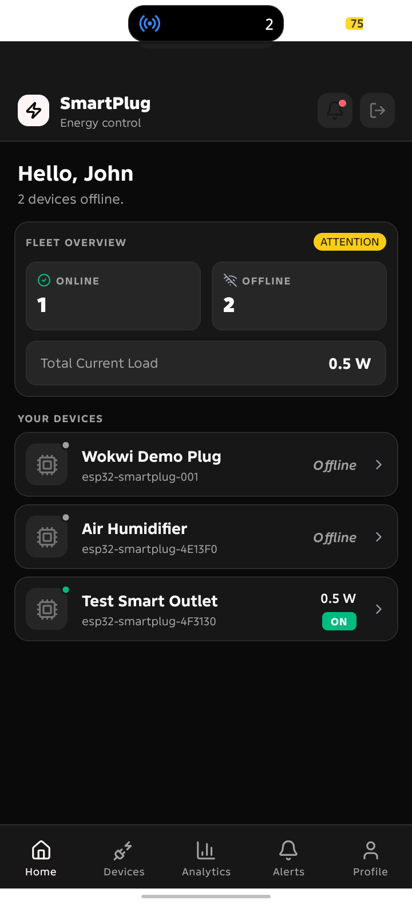

---

## Architecture

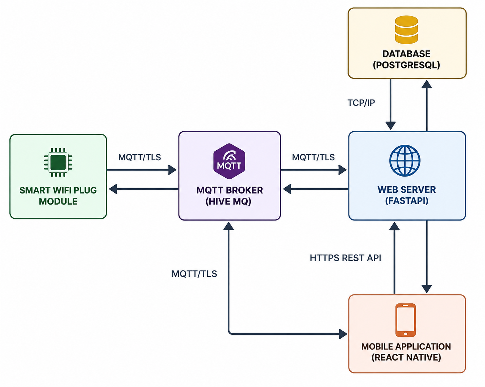

The system has four components:

- **Smart WiFi Plug Module** (ESP32-C3 firmware): reads live electrical parameters from the PZEM-004T sensor, switches the relay, and publishes and subscribes to MQTT topics over TLS.
- **MQTT Broker** (HiveMQ Cloud): the sole channel between the device and everything else. All communication is TLS-encrypted and authenticated.
- **Web Server** (FastAPI): subscribes to device telemetry, persists it to PostgreSQL, computes daily and monthly summaries, enforces energy limits with automatic cutoff, and exposes a JWT-authenticated REST API. It also publishes backend-originated MQTT messages, like derived summaries, online status, and timer or cutoff-triggered relay commands.
- **Mobile Application** (React Native / Expo): talks to the Web Server over HTTPS for everything that isn't real-time, like auth, historical data, device management, timers, and limits, and connects directly to the MQTT broker for low-latency live telemetry and relay state.

Google Assistant integration (see [Google Home Integration](#google-home-integration)) isn't a new physical connection in this diagram. It talks to the Web Server the same way the mobile app's REST calls do, through an OAuth-authenticated webhook. There's also a separate outbound call from the Web Server to Google's Home Graph API for proactive state updates.

---

## Features

**Device control**
- Manual relay ON/OFF from the mobile app, with optimistic UI updates confirmed by live MQTT relay-state feedback
- Physical push-button control at the device, with local NVS-persisted state that survives reboot or power loss
- Voice control via Google Assistant ("Hey Google, turn on Air Humidifier")

**Live telemetry**
- Voltage, current, power, energy, frequency, and power factor, updated every 10 seconds
- WiFi signal strength (RSSI) with a human-readable signal-quality label
- Device online/offline status, detected two ways: MQTT Last Will and Testament (LWT) for ungraceful disconnects, plus a backend staleness sweep as a second line of defense

**Analytics & history**
- Today's and this month's energy consumption, with estimated cost based on a user-configured billing rate
- Arbitrary month browsing, not just a fixed rolling window, with a daily/weekly chart granularity toggle
- Fleet-level (all-devices) cost view that correctly excludes, rather than zero-fills, devices without a billing rate set

**Automation**
- Named, recurring daily timers (e.g. "Turn off at 22:00"), self-healing if the server was briefly down at the trigger time
- Configurable daily and monthly energy limits (kWh) with automatic relay cutoff on breach, plus event notifications
- Cutoff state is protected from being silently overridden by unrelated device updates or timers

**Google Home integration**
- OAuth2 account linking between the Google Home app and an existing SmartPlug account
- `SYNC` / `QUERY` / `EXECUTE` fulfillment for on/off control
- Proactive Report State, so external state changes (mobile app toggle, timer firing, auto-cutoff) reflect in Google Home without the user needing to ask
- Request Sync, so newly linked devices appear immediately rather than waiting on Google's own refresh schedule

**Security**
- JWT access/refresh token auth with rotation and reuse detection, where a replayed, already-used refresh token revokes every active session for that user
- OTP-based email verification and password reset, with generic error messages to prevent account enumeration
- TLS-authenticated MQTT broker, migrated from a public, unauthenticated broker used during early development
- Per-device ownership checks on every device-scoped API call

**Simulation**
- A full Wokwi simulation of the firmware, including a custom-built PZEM-004T chip (no stock Wokwi part exists for it) that models realistic energy accumulation over time

---

## Tech Stack

| Component | Technology |
|---|---|
| **Firmware** | ESP32-C3, ESP-IDF, C |
| **Sensing** | PZEM-004T (Modbus RTU over UART) |
| **Backend** | Python, FastAPI, SQLModel, Alembic |
| **Database** | PostgreSQL (Aiven), SQLite (local dev) |
| **Messaging** | MQTT (HiveMQ Cloud, TLS), `fastapi-mqtt` / `gmqtt` |
| **Auth** | JWT (PyJWT), Argon2 password hashing (`pwdlib`) |
| **Mobile** | React Native, Expo (SDK 57), Expo Router |
| **Mobile state** | Zustand, TanStack Query |
| **Mobile UI** | Gluestack UI, NativeWind (Tailwind for React Native) |
| **Charts** | `react-native-gifted-charts` |
| **Voice integration** | Google Smart Home (Cloud-to-cloud), Google Home Graph API |
| **Simulation** | Wokwi (custom C-based chip plugin for PZEM-004T) |
| **Backend hosting** | pxxlspace |
| **Mobile builds** | EAS Build |

---

## How It Works

This section covers the software design decisions behind the system. The electrical and sensing side, meaning voltage/current sensing, Modbus register layout, and power supply design, is documented in the [project report](#project-report) instead, to avoid duplicating it here.

### MQTT topic design

All communication runs through a single namespace, `smartplug/{device_id}/...`. Topics split into two categories, marked by a `be-` prefix:

- **Device-originated** (`telemetry`, `relay/state`, `wifi/result`): published by the firmware. The mobile app subscribes to these directly for low-latency live updates.
- **Backend-originated** (`be-online-status`, `be-daily-summary`, `be-monthly-summary`, `be-timer-lock`, `energy-event`): published by the backend after it turns raw device data into something derived, like an online/offline determination or a computed daily total. This split means the mobile app never has to replicate backend logic client-side. It just subscribes to the backend's already-computed answer instead of recomputing something like "is this device actually offline" from raw timestamps itself.

Command topics (`relay/command`, `wifi/command`) can be published by any authorized actor: the mobile app, the backend's timer sweep, auto-cutoff logic, or the Google Home fulfillment webhook. Only the firmware consumes them. This is how Google Assistant controls a device without ever talking to it directly. It just publishes to the same topic the app would use.

A few MQTT choices worth mentioning: state topics (`be-online-status`, `be-daily-summary`, relay state) are retained, so a client connecting mid-session gets the last known value right away instead of waiting for the next update. Everything uses QoS 1 for at-least-once delivery. Keepalive is set to 30 seconds, tightened down from an unset default early in development, to shrink the worst-case time it takes to detect a dead connection.

### Energy accounting model

The PZEM-004T's energy register is a counter that only ever increases, and it only resets through an explicit hardware command the firmware never sends. That means consumption for a given period can't be read off directly, it has to be derived. The backend's `DeviceDailySummary` table stores `energy_first` (the meter reading at the first message of the day) and `energy_last` (updated on every message after that), so `kwh_consumed = energy_last - energy_first`. This survives reboots cleanly: the meter's own counter doesn't reset on a power cycle, so the next telemetry message after a reboot just keeps updating `energy_last` against the same day's `energy_first` baseline. No special reboot-recovery logic needed.

The same idea extends to arbitrary date ranges for the analytics month picker, by summing `kwh_consumed` across the relevant daily rows instead of querying raw meter deltas over a range.

### Two independent lock states

A device can be non-controllable for two separate reasons, modeled as independent fields instead of one combined "locked" flag:

- **`cutoff_reason` / `cutoff_at`**: set when a daily or monthly energy limit is breached. Only clears when the user explicitly changes a limit value, not by toggling `auto_cutoff_enabled` alone and not by any timer or manual command.
- **`timer_lock_reason` / `timer_locked_at`**: set whenever a scheduled timer fires, recording which timer and why. Clears through an explicit "rearm" action, independent of cutoff state.

Wherever a relay command can originate, whether that's the mobile app, the timer sweep, or Google Home's `EXECUTE`, the same rule applies: an ON command is refused if `cutoff_reason` is set, no exceptions. That's what stops a voice command or a scheduled "turn on" timer from quietly undoing a safety cutoff.

### Online/offline detection

Two independent mechanisms mark a device offline, because relying on just one has a real failure mode:

1. **MQTT Last Will and Testament (LWT):** the broker automatically publishes an offline message if the device's connection drops uncleanly. Fast, but it depends on the broker successfully delivering that message, which isn't guaranteed on every broker or network condition.
2. **Backend staleness sweep:** runs every 15 seconds and marks any device offline if its `last_seen` timestamp is older than twice the expected telemetry interval. This covers the case where LWT quietly fails to fire, which is rare but real enough to be worth defending against.

### Auth model

Auth uses JWT access and refresh tokens, with rotation and reuse detection. Every refresh call issues a new pair and revokes the old refresh token. If a revoked refresh token ever gets presented again, which is the signature of a stolen token being replayed, every active refresh token for that user gets revoked immediately, forcing a re-login everywhere rather than assuming it's a false alarm. Password changes and resets follow the same forced-logout pattern on purpose. Every device-scoped endpoint returns 404, not 403, for a device that exists but belongs to someone else, so it never confirms a given device_id exists to someone who doesn't own it.

### Optimistic UI with MQTT reconciliation

Tapping a relay toggle in the app updates the UI right away, before any network round-trip finishes, then reconciles against the real `relay/state` message the firmware publishes once it actually applies the command. This same reconciliation path is what makes Google Home's proactive Report State useful: a state change from any source, whether that's an app tap, a timer, a cutoff, or a voice command, ends up on the same `relay/state` topic, so every client watching it stays consistent no matter who issued the original command.

---

## Application Walkthrough

### Getting Started

| | |
|---|---|
| 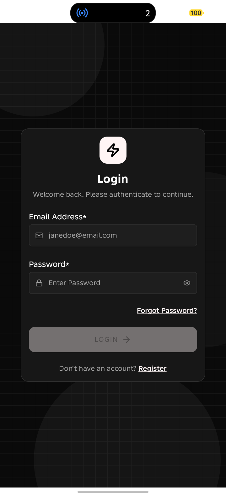 | 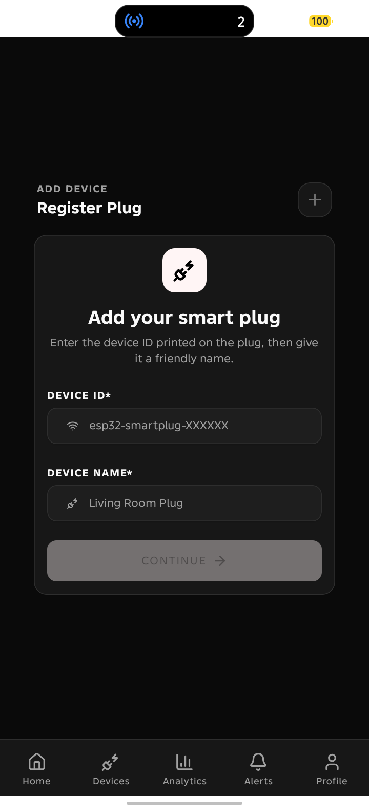 |
| Login | Add a device |

### Monitoring

| | |
|---|---|
|  | 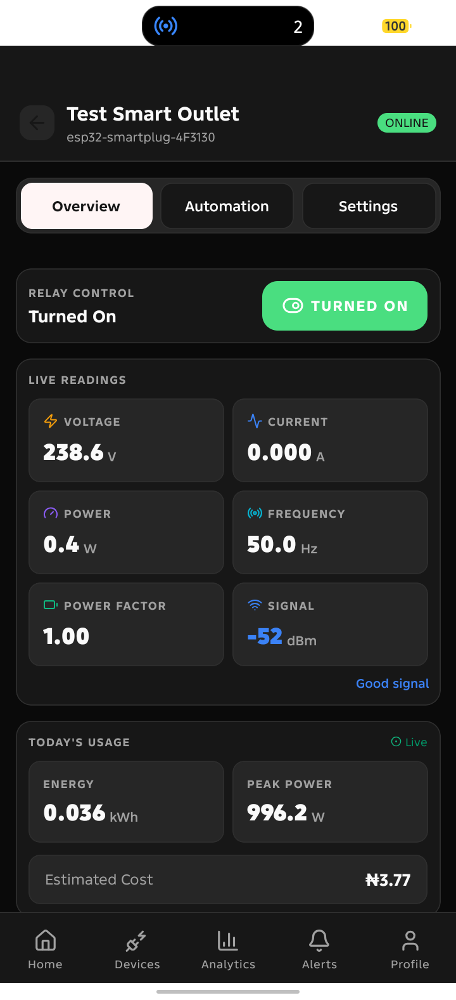 |
| Home, all devices at a glance | Device overview, live readings |

### Analytics

| | |
|---|---|
| 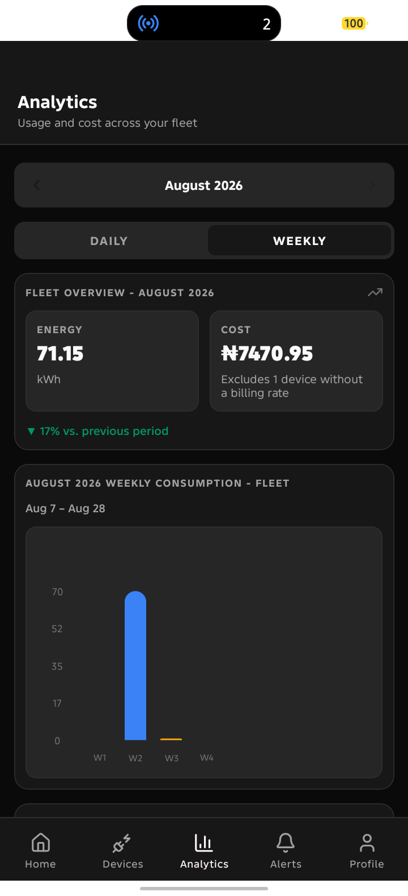 | 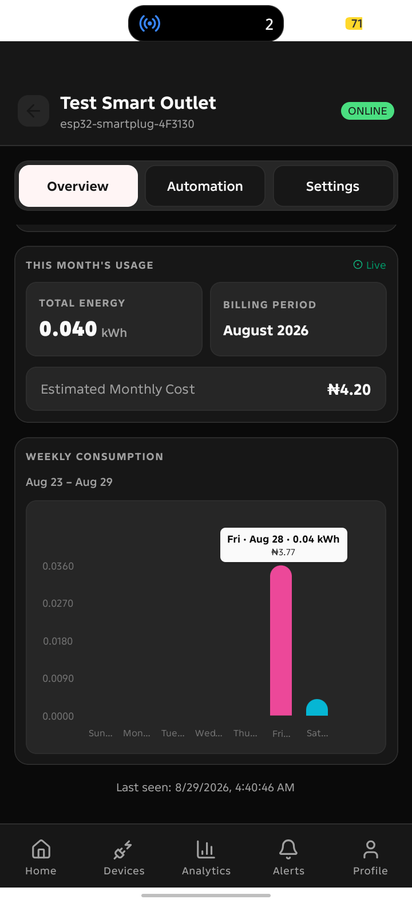 |
| Fleet-wide analytics | Per-device weekly usage |

### Automation & Limits

| | |
|---|---|
| 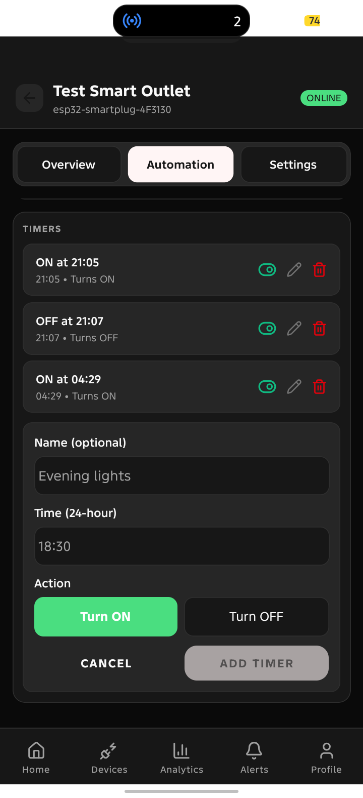 | 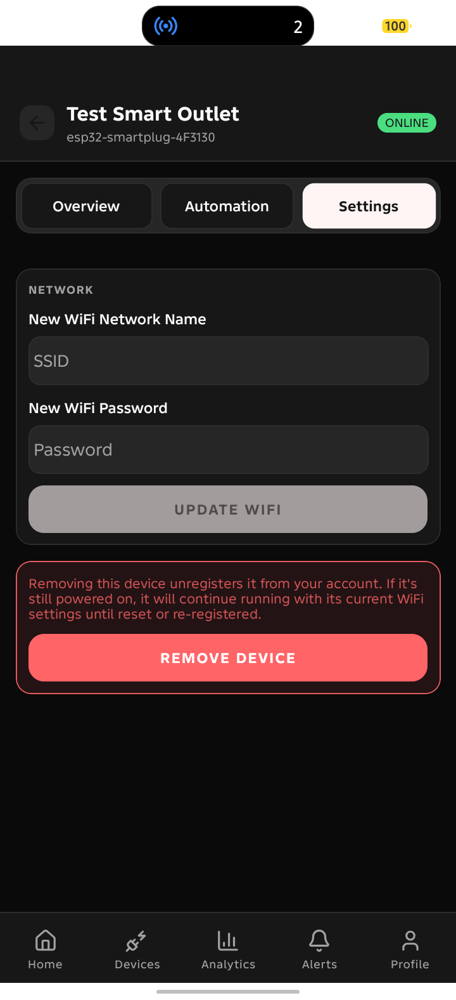 |
| Timers and energy limits | Device settings |

### Automation in Action

| | |
|---|---|
| 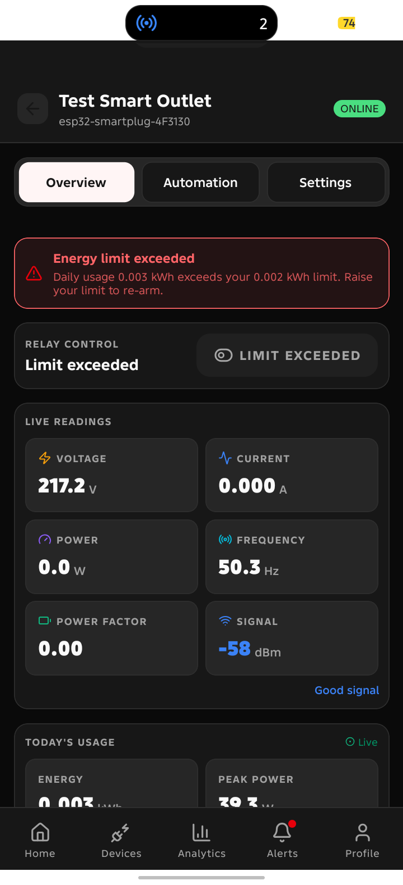 | 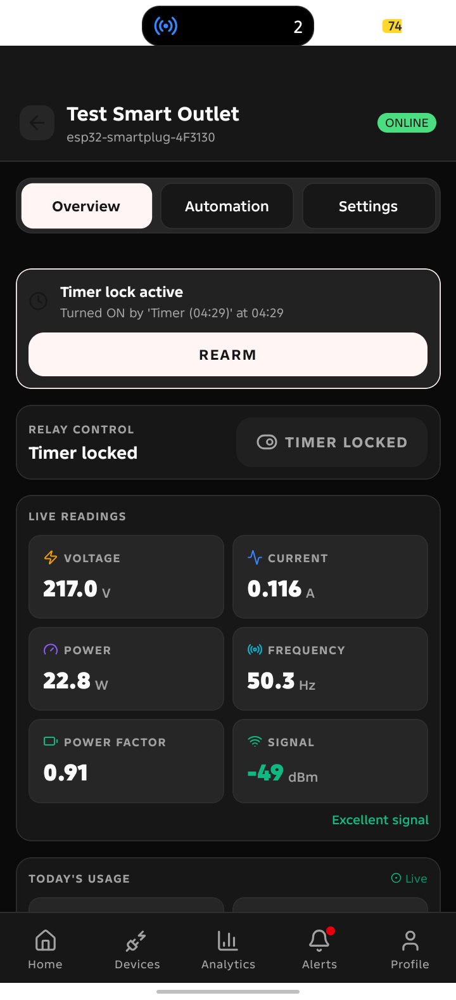 |
| Auto-cutoff after a limit breach | A scheduled timer firing |

### Account

| | |
|---|---|
| 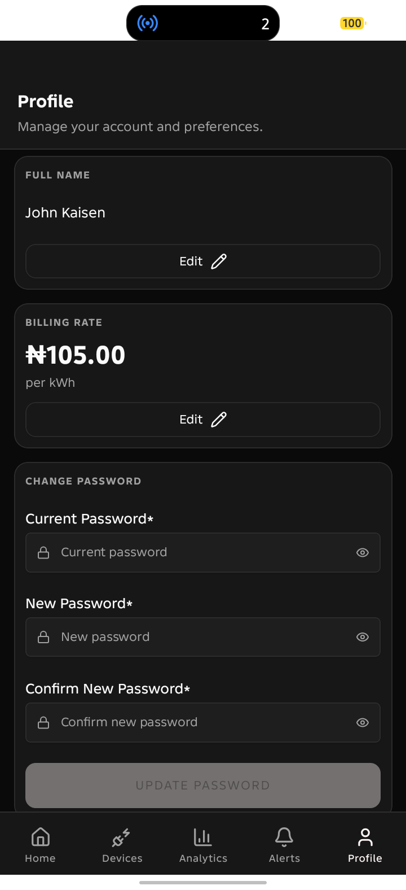 | 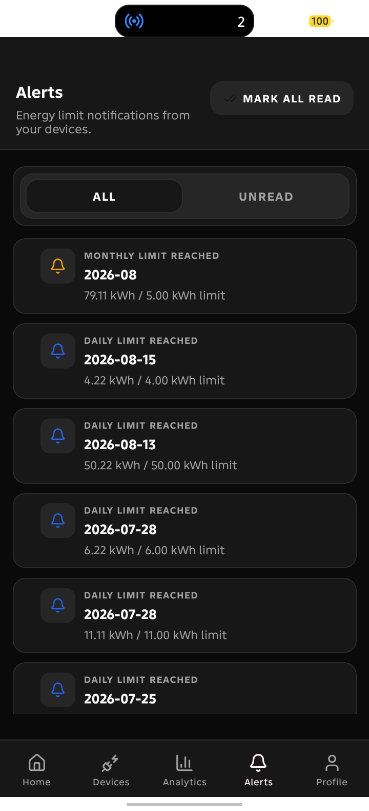 |
| Profile | Alerts / notifications |

### Google Home
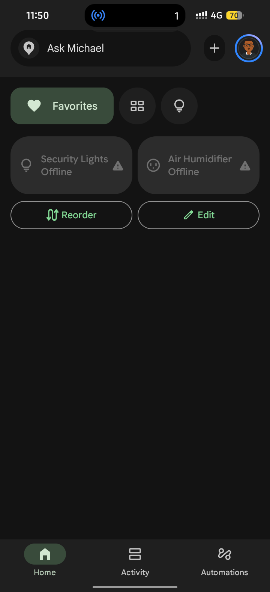

---

## Repository Structure

```
smartplug/
├── firmware/                      # ESP32-C3 firmware (ESP-IDF)
│   ├── main/
│   │   ├── main.c                 #   app entry point, task startup
│   │   ├── config.h                #   pin assignments, MQTT broker URI, task priorities
│   │   ├── wifi.c / wifi.h         #   WiFi connection lifecycle
│   │   ├── wifi_manager.c/.h       #   WiFi state machine (connect/reconnect)
│   │   ├── wifi_creds.c/.h         #   NVS-persisted WiFi credentials
│   │   ├── provisioning.c/.h       #   SoftAP + HTTP server for first-time WiFi setup
│   │   ├── mqtt.c/.h                #   MQTT client setup, command subscriptions
│   │   ├── mqtt_topics.c/.h         #   topic string builders
│   │   ├── mqtt_secrets.h          #   gitignored, MQTT_USERNAME/PASSWORD (template: mqtt_secrets.h.example)
│   │   ├── pzem_task.c/.h           #   telemetry read + publish loop
│   │   ├── relay.c/.h               #   relay GPIO control, NVS state persistence
│   │   ├── button.c/.h              #   physical button, local-only relay toggle
│   │   ├── sntp.c/.h                #   time sync (used for telemetry timestamps)
│   │   └── device_id.c/.h           #   derives a stable device ID from the MAC address
│   ├── components/                #   PZEM-004T Modbus driver
│   ├── diagram.c3-mini.json       #   Wokwi diagram, real hardware (ESP32-C3 Mini)
│   ├── pzem004t.chip.c            #   custom Wokwi chip: simulated PZEM-004T with energy accumulation
│   └── wokwi.toml
│
├── backend/                       # FastAPI backend
│   ├── main.py
│   ├── routes/                    #   auth, devices, telemetry, timers, events, user, google_home
│   ├── models/                    #   SQLModel table definitions
│   ├── schemas/                   #   Pydantic request/response schemas
│   ├── mqtt/                      #   MQTT client, message handlers, timer/staleness sweeps
│   ├── energy_limits/             #   limit-checking + cutoff logic
│   ├── integrations/              #   Google Home Graph API client
│   ├── auth/                      #   JWT, OTP, password hashing, ownership checks
│   ├── migrations/                #   Alembic migrations
│   └── scripts/                   #   factory device provisioning, demo data seeding
│
└── mobile/                        # React Native (Expo) app
    └── src/
        ├── app/                   #   Expo Router file-based routes
        │   ├── (auth)/            #     login, register, password reset, OTP verification
        │   └── (app)/             #     home, devices, device/[id] (tabs), analytics, alerts, profile
        ├── api/                   #   axios client + per-resource API modules
        │   ├── client.ts          #     base axios instance, JWT refresh/retry interceptor
        │   ├── auth-api.ts        #     login, register, OTP, password reset
        │   ├── devices-api.ts     #     device CRUD, limits
        │   ├── telemetry-api.ts   #     energy history, today/monthly summaries
        │   ├── timers-api.ts      #     automation timers, timer-lock rearm
        │   ├── events-api.ts      #     energy-limit breach notifications
        │   ├── users-api.ts       #     profile, billing rate, change password
        │   └── provisioning-api.ts #    talks to the device's SoftAP (192.168.4.1) during WiFi setup
        ├── lib/                   #   MQTT client
        └── store/                 #   Zustand stores (auth, device state, etc.)
```

---

## Getting Started

### Backend

```bash
cd backend
python -m venv .venv-be
source .venv-be/bin/activate
pip install -r requirements.txt

cp .env.example .env
# fill in .env, see backend/.env.example for what's required

alembic upgrade head   # creates all tables, required on a fresh database
```

Run the dev server (uses `fastapi-cli`'s dev mode, with auto-reload, and serves Swagger UI at `/docs`):

```bash
source fastapi_start
# equivalent to: fastapi dev --host 0.0.0.0
```

API docs: `http://localhost:8000/docs`

### Firmware

```bash
cd firmware
cp main/mqtt_secrets.h.example main/mqtt_secrets.h
# fill in MQTT_USERNAME / MQTT_PASSWORD

idf.py set-target esp32c3
idf.py build
idf.py -p /dev/ttyACM0 flash monitor   # adjust port for your system
```

On first boot with no saved WiFi credentials, the device starts its own WiFi-setup access point. See [Device Provisioning](#device-provisioning) for how to connect it to a network.

### Mobile

```bash
cd mobile
npm install

cp .env.example .env
# fill in EXPO_PUBLIC_MQTT_USERNAME / EXPO_PUBLIC_MQTT_PASSWORD
```

Set `EXPO_PUBLIC_API_BASE_URL` in `.env` to point at your running backend.

This app can't run in plain Expo Go. It uses native modules, MQTT over raw TCP sockets and Reanimated 4/Worklets, that Expo Go doesn't support. Build a development client first:

```bash
npx expo run:android   # or: npx expo run:ios
```

Then for subsequent runs, just start Metro and connect the already-installed dev client:

```bash
npx expo start
```

---

## Deployment

### Backend

Deployed on [pxxlspace](https://pxxlspace.cv). This is a personal project, so the live deployment is kept running for demonstration purposes only and isn't guaranteed to stay online indefinitely. Treat the URL below as a point-in-time reference, not a permanent service, and see [Getting Started](#getting-started) to run it yourself.

**Live demo (may go offline):** `https://smart-wifi-socket.pxxlspace.cv`

Deployment steps:

1. Push to the connected repository, or trigger a manual deploy depending on how pxxlspace is configured.
2. Set all variables from `backend/.env.example` in the platform's environment variable settings. Real values are never committed to the repo.
3. Run migrations against the production database after the first deploy, and after any new migration is added: `alembic upgrade head`. This doesn't happen automatically. It has to be triggered explicitly, either by hand or by wiring it into a release-phase hook if the platform supports one.

### MQTT Broker

[HiveMQ Cloud](https://www.hivemq.com/mqtt-cloud-broker/), a managed, TLS-authenticated broker. The project began on the public, unauthenticated `broker.hivemq.com` during early development and was migrated to a private authenticated instance before any real-world testing.

### Mobile

Built via [EAS Build](https://docs.expo.dev/build/introduction/):

```bash
eas build --profile preview --platform android
```

Environment variables for the build (`EXPO_PUBLIC_MQTT_USERNAME`, `EXPO_PUBLIC_MQTT_PASSWORD`, `EXPO_PUBLIC_API_BASE_URL`) need to be configured in the EAS project's environment settings, either through `eas env:create` or the Expo dashboard. They aren't read from a local `.env` file at build time on EAS's servers, only during local `expo start`.

### Local development against a live third-party callback (e.g. Google Home)

For iterating on backend code that needs a real, publicly reachable URL, Google's OAuth and fulfillment callbacks being the main example, a tunnel to the local dev server works well without redeploying on every change:

```bash
cloudflared tunnel --url http://localhost:8000
```

This gives a temporary public HTTPS URL forwarding to the local backend, useful for testing webhook-style integrations without a full deploy per iteration. The URL changes each time the tunnel restarts unless a reserved or named tunnel is configured.

---

## API Reference

Full interactive API documentation (Swagger UI) is auto-generated by FastAPI and is the source of truth for request/response shapes, status codes, and auth requirements. It's available at `/docs` on whichever backend you're running.

**Live demo (may go offline, see [Deployment](#deployment)):** `https://smart-wifi-socket.pxxlspace.cv/docs`

Route groups:

| Prefix | Covers |
|---|---|
| `/auth` | Register, login, refresh/logout, OTP email verification, password reset |
| `/devices` | Device CRUD, energy limits, timers (nested), timer-lock rearm |
| `/telemetry` | Raw readings, today's/monthly energy summaries, historical range queries |
| `/events` | Energy-limit breach notifications (list, mark read) |
| `/users` | Profile updates, billing rate, change password |
| `/google-smarthome` | OAuth account linking (`/authorize`, `/token`) and the Google Home fulfillment webhook, see [Google Home Integration](#google-home-integration) |

Every device-scoped endpoint enforces ownership on the server. A device belonging to another user returns 404, not 403, so it never confirms whether a given device ID exists at all.

---

## Google Home Integration

Voice and tap control through Google Assistant ("Hey Google, turn on Air Humidifier"), built as a Cloud-to-cloud Smart Home integration. Google never talks to the device directly. It talks to the backend, which then issues the same MQTT relay command the mobile app would.

### Architecture

1. **Account linking (OAuth2):** the backend implements its own `/authorize` and `/token` endpoints, reusing the existing JWT access and refresh token machinery instead of building a separate auth system. Google is treated as just another OAuth client. It gets assigned a client ID and secret, generated by this project rather than issued by Google, which it presents at `/token` either as form fields or an HTTP Basic Auth header. Both are supported since Google's behavior here depends on a console setting.
2. **Fulfillment webhook:** a single endpoint (`/google-smarthome/fulfillment`) handles Google's three Smart Home intents:
   - `SYNC`: returns the user's devices, mapped to Google's `action.devices.types.OUTLET` type with the `OnOff` trait.
   - `QUERY`: returns current on/off and online state, read directly from the `devices` table.
   - `EXECUTE`: publishes an MQTT relay command through the same backend helper (`_publish_relay_command`) used by the timer sweep and auto-cutoff logic, and respects the same cutoff guard. An `EXECUTE` command can't silently override an active auto-cutoff.
3. **Report State:** a Google Home Graph API client (`integrations/homegraph.py`) proactively pushes state changes to Google whenever the relay or online state changes for a reason other than a Google-initiated command, like a mobile app toggle, a timer firing, an auto-cutoff, or the staleness sweep marking a device offline. Without this, Google Home's UI would only reflect state whenever it happened to ask, making a device look stale or unresponsive after any change made elsewhere.
4. **Request Sync:** called right after a successful account link, so newly linked devices show up in Google Home without waiting on Google's own refresh schedule.

### Setup (for anyone replicating this)

1. Create a project in the [Google Home Developer Console](https://console.home.google.com), and add a Cloud-to-cloud integration.
2. Under Account linking, set:
   - Client ID and secret: any URL-safe random strings you generate, matching `GOOGLE_SMARTHOME_CLIENT_ID` / `GOOGLE_SMARTHOME_CLIENT_SECRET`
   - Authorization URL: `<your-backend>/api/v1/google-smarthome/authorize`
   - Token URL: `<your-backend>/api/v1/google-smarthome/token`
3. Under Cloud fulfillment, set the fulfillment URL: `<your-backend>/api/v1/google-smarthome/fulfillment`.
4. Enable the HomeGraph API in the associated Google Cloud project, create a service account, and set its JSON key as `GOOGLE_HOMEGRAPH_SERVICE_ACCOUNT_JSON`.
5. Testing works against your own linked Google account directly from the Google Home app. No formal certification or review submission is required just to test.

### Supported commands today

- "Turn on/off [device name]"
- "Is [device name] on?"
- Relative-delay commands ("turn off [device] in 10 minutes") work for free, since Google Assistant handles that scheduling itself and just calls the same `EXECUTE` endpoint after the delay.
- Adding a SmartPlug device to a Google Home Routine, like a "Good Night" routine that turns off multiple devices, works with no additional code, since it's a natural consequence of implementing the standard `OnOff` trait.

### Explicitly out of scope

Setting app-specific things by voice, like named recurring timers or kWh energy limits, has no equivalent in Google's Smart Home trait vocabulary. There's no trait for "daily energy limit." Supporting that would need a different, newer integration surface (Gemini Extensions or App Actions) that hasn't been evaluated for this project. PIN-based confirmation for sensitive commands and a `Toggles` trait for things like voice-toggling auto-cutoff were both considered and deferred, since getting core on/off control solid came first.

---

## Device Provisioning

### Factory pre-registration

Before a device reaches a user, its `device_id` is pre-registered in the database via a small script. It stays disabled and unowned until claimed:

```bash
python -m scripts.provision_devices esp32-smartplug-001
# or multiple at once:
python -m scripts.provision_devices esp32-smartplug-002 plug_01
```

This models a factory provisioning step. Only device IDs that already exist in this table can later be claimed by a user through the mobile app's add-device flow.

### First-time WiFi setup (SoftAP)

On boot, if no WiFi credentials are saved in NVS, the firmware starts its own access point instead of trying to connect anywhere:

1. The device broadcasts an AP named `SmartPlug-<last 6 hex chars of device ID>` (e.g. `SmartPlug-4E13F0`), password `password<same 6 chars>`.
2. A phone connects to this AP from the mobile app's provisioning screen, not by manually joining it through system WiFi settings. Joining manually leaves nothing to actually submit the credentials, so the app has to drive this step.
3. The app POSTs the target network's SSID and password to `http://192.168.4.1/wifi`, a small HTTP server the firmware runs while in provisioning mode.
4. The firmware attempts to connect to that network. On success, it persists the credentials to NVS, drops its own AP, and responds `{"status": "connected"}`. On failure, it responds `{"status": "failed"}` and stays in AP mode for another attempt.

One real gotcha here: connecting a phone to an AP with no internet access can make the phone's OS route app traffic over cellular data instead of the local WiFi link. That silently fails to reach `192.168.4.1` even though the WiFi connection itself looks fine. The mobile client treats a network-level failure at this step as `ambiguous` rather than a hard failure, since the device may have already succeeded and just dropped its AP before the HTTP response got delivered.

### Planned: QR code provisioning

Not built yet. The idea is a QR code printed on the device or its packaging, encoding the AP's SSID and password, scanned by the app to skip manual network selection during the SoftAP-join step above. This wouldn't change the underlying HTTP provisioning protocol. It just removes a manual step in getting the phone onto the device's AP in the first place.

---

## Wokwi Simulation

No stock Wokwi part exists for the PZEM-004T, so the sensor is simulated with a custom-built Wokwi chip (`firmware/pzem004t.chip.c`), written directly against the Wokwi Chip API rather than relying on a community part.

### Why a custom chip was necessary

A naive simulated PZEM would just report whatever value a slider is set to. But a real PZEM's energy register is a running total that only ever increases, driven by actual elapsed time and power draw, not something you can just read off a dial. The custom chip models this properly:

- Voltage, current, power, frequency, and power factor are live-adjustable sliders in the Wokwi UI.
- **Energy is not a slider.** It's continuously integrated in software from the `power` slider over real elapsed simulation time (`accumulated_energy_wh += power × pf × Δt_hours`, ticking once per second via a Wokwi timer), matching how the real PZEM's Modbus energy register behaves. The `energy` slider gets read exactly once at boot, as a starting offset representing a meter that's already been running for a while. After that it's ignored.
- The chip implements the same Modbus RTU framing, CRC-16 checksum, and register map the real PZEM-004T uses, so the firmware's actual production driver code runs unmodified against the simulation. This isn't a stubbed-out fake protocol, it's the real wire format.

An earlier, simpler chip variant with a static energy value and no accumulation exists in project history but has been superseded and removed. The accumulating version is the one `wokwi.toml` references and the one used for all simulation runs.

### Circuit

`diagram.c3-mini.json` is the diagram matching the real assembled hardware (ESP32-C3 Mini). It includes:
- The custom PZEM-004T chip (UART, Modbus RTU)
- A relay module simulating the load-switching output
- A push-button simulating the physical local-control button
- An LED and resistor as a visual relay-state indicator on the breadboard

### Running it

1. Install the [Wokwi VS Code extension](https://marketplace.visualstudio.com/items?itemName=Wokwi.wokwi-vscode) (requires a free Wokwi account for simulating custom chips).
2. Install [`wokwi-cli`](https://docs.wokwi.com/wokwi-ci/cli-installation), used to compile the custom PZEM-004T chip from C source into the `.wasm` binary Wokwi actually loads. This is a separate step from the extension itself: the extension simulates, the CLI compiles the custom chip. It uses a bundled WASI-SDK toolchain, downloaded automatically on first use.
3. From `firmware/`, compile the chip:
   ```
   wokwi-cli chip compile pzem004t.chip.c
   ```
   This produces `pzem004t.chip.wasm` and `pzem004t.chip.json`, referenced by the `[[chip]]` entry in `wokwi.toml`. Re-run this whenever `pzem004t.chip.c` changes.
4. Build the firmware normally (`idf.py build`). Wokwi runs the real compiled `.elf`/`.bin`, not a separate mock build.
5. Press **F1** and choose `Wokwi: Start Simulator` (or use the Wokwi sidebar), which reads `wokwi.toml` to locate the built firmware, the compiled chip, and `diagram.c3-mini.json` for the circuit.
6. Adjust the PZEM chip's sliders live during simulation to test different load conditions, and use the on-screen push-button to test local relay control.

### What the simulation does and doesn't cover

Fully covered: relay control logic, MQTT connectivity against the real HiveMQ Cloud broker (the simulated ESP32 has real network access), telemetry publishing, timer/cutoff logic, and the WiFi provisioning flow.

Not covered, because it can't be: real mains electrical behavior, like actual voltage sag under load, genuine current transformer response, or real EMI and noise on the power rail. Those are exactly the things validated separately against physical hardware in [Results & Testing](#results--testing).

---

## Hardware

The design targets three constraints: safety at mains voltage, physical compactness (it fits a standard single-gang back box), and low prototype cost. Full electrical design detail, including the power supply chain, sensing principles, the Modbus register map, and communication protocol timing, lives in the [project report](#project-report). What's summarized here is just what a software reader needs.

### Bill of Materials

| Component | Specification | Why |
|---|---|---|
| ESP32-C3 Mini | Single-core, 160MHz, WiFi 802.11 b/g/n, 400KB SRAM | Mature ESP-IDF ecosystem, integrated WiFi eliminates an external module |
| PZEM-004T v3.0 (100A) | 80–260V, 0–100A, UART/Modbus RTU, TTL 5V | Voltage/current/power/energy/frequency/PF in one module, non-invasive CT clamp |
| HLK-PM05 | 100–240 VAC in, 5VDC 1000mA out | Compact, certified, no external components needed |
| 1-Channel Relay Module | 5V coil, 10A @ 250VAC contacts, optically isolated | Optocoupler isolates MCU logic from relay coil transients |
| Current Transformer | 100A rated split-core, matched to PZEM-004T 100A variant | Non-invasive, measures without breaking the live conductor |
| Fuse | Ceramic cartridge, 13A, 5×20mm, slow-blow | Overcurrent protection; slow-blow tolerates switch-on inrush |
| Varistor | S10K230, 230V rated | Absorbs mains voltage transients/surges |
| Class X2 Capacitor | 0.1µF 275VAC, polypropylene film | EMC line filtering; fails open rather than shorting |
| Common Mode Choke | 2mH, 10A | Suppresses common-mode EMI from the switching PSU |
| Output Capacitor | 100µF 25V electrolytic, low-ESR | Smooths the 5V rail, reduces ripple to the MCU/relay |

### Relay Control

The control side connects to GPIO 10 per `firmware/main/config.h`, reassigned from an earlier layout during physical construction (the project report's Section 3.4.5 predates this change and still says GPIO 5). The optocoupler isolates this low-voltage control signal from the relay coil, and by extension from the switched mains circuit. It's wired normally-open, so the load is disconnected by default with no power applied to the coil. That's the safe state on a firmware crash or unexpected reset.

### Assembly

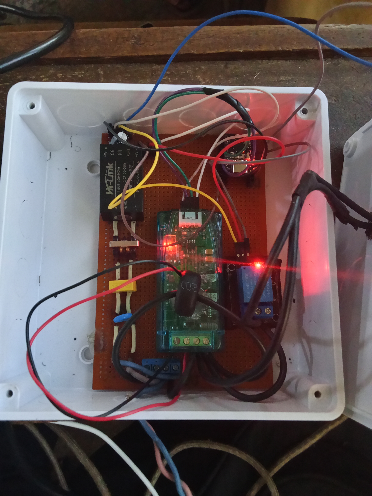
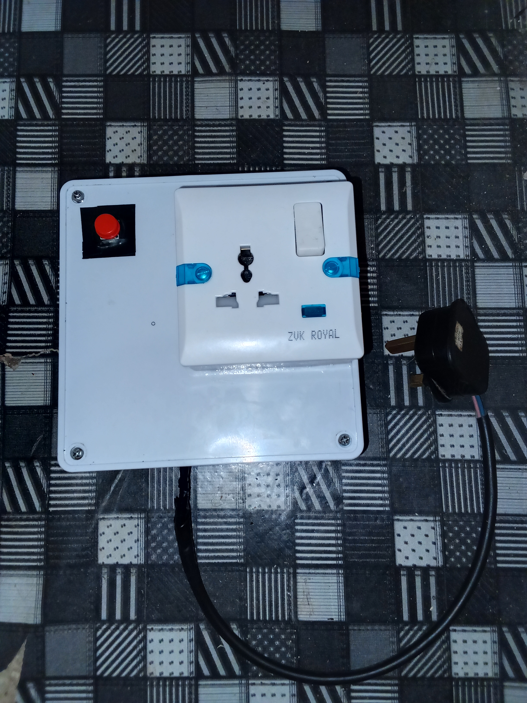

---

## Results & Testing

Formal evaluation was carried out for the accompanying project report, covering measurement accuracy, remote-control latency, and reliability across three real household loads: a soldering iron, a pressing iron, and a phone charger, spanning a 100x power range and both resistive and switch-mode electronic load types. Full methodology, raw per-sample data, and discussion live in the [project report](#project-report). The headline results:

| Metric | Result |
|---|---|
| Voltage measurement error (vs. reference multimeter) | 1.35%–1.63% mean absolute percentage error, consistent across all three test loads |
| Remote relay control response time | 1135.5 ms average (592–1604 ms range), over a mobile 4G connection |
| Relay switching & telemetry stability | Consistent across all three loads (12W–1200W) |

Current, power, power factor, and energy are reported as system observations, not independently validated measurements. No clamp meter or wattmeter was available to cross-check them against a reference instrument, unlike voltage. This project is upfront about that distinction instead of presenting every reading as equally verified.

---

## Project Report

The full project report is included in this repository. It covers detailed hardware design and component selection math, sensing principles, circuit protection design, complete test methodology, and per-sample results and discussion.

**[`docs/project-report.pdf`](docs/project-report.pdf)**

---

## License

MIT. See [LICENSE](LICENSE).